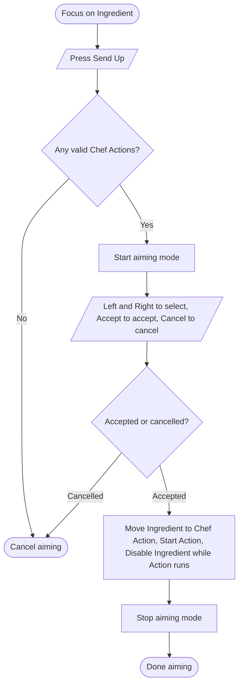

Ingredient-Chef Action Aiming Flowchart
=======================================

After sending, focus should be moved to the first ingredient in the area that was left, or if not possible, the
left-most ingredient in the pantry, prep area, or plating area in that order.
